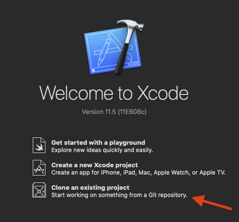
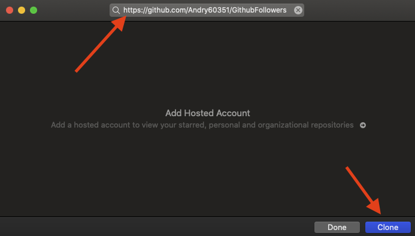

# GithubFollowers app
 

With this iOS app it's possible to check someone's github followers and view their profiles.
You can also save GitHub profiles locally in the "favourites" tab and remove them with gestures.

  

# Technologies used
This app has been made from scratch (no framework used) with Swift5, XCode, programmaticUI, the GitHub API and the MVC architecture.

# Requirements
 - MacOS catalina
 - XCode 11
 - Swift 5
 - an iPhone with iOS 13.0 +
 
 
# How to clone
1) Open xcode

2) Click on "Clone an existing project"

3) Paste the link on the search bar, and click clone.

