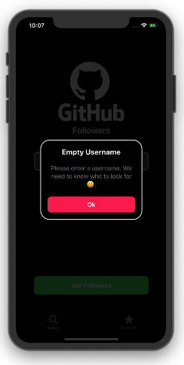

# GithubFollowers
With this iOS app it's possible to check someone's github followers details. You can also save GitHub profiles in the "favourites" (which are saved locally) tab and remove them.

 

# Requirements
 - MacOS catalina
 - XCode 11
 - Swift 5
 - an iPhone with iOS 13.0 +
 
# How to clone and run 
1) Open xcode
2) Click on "Clone an existing project"
3) On the search bar on the top, paste the url of this repo and click clone.

# More screenshots
 

